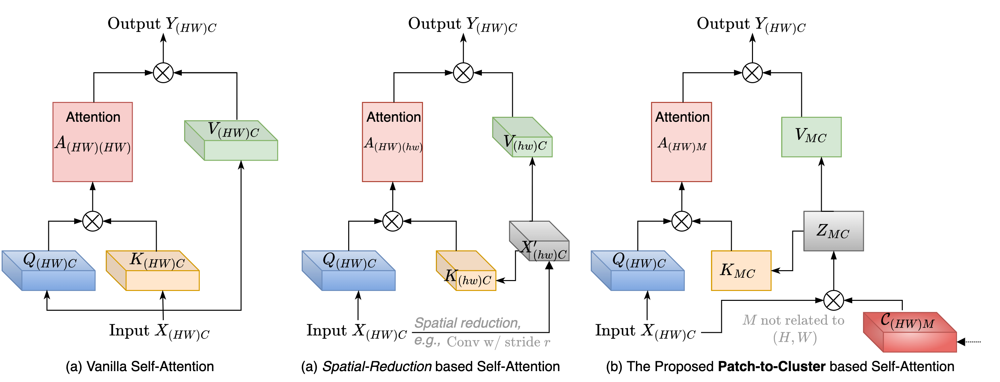
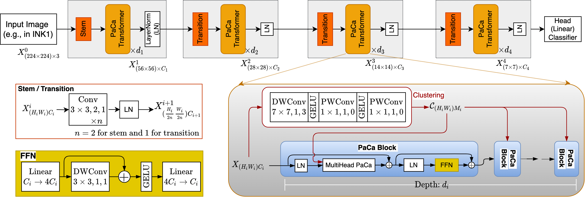
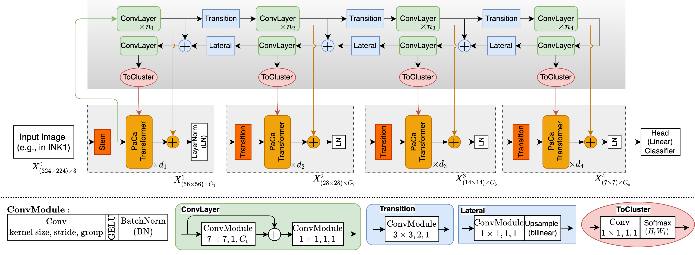
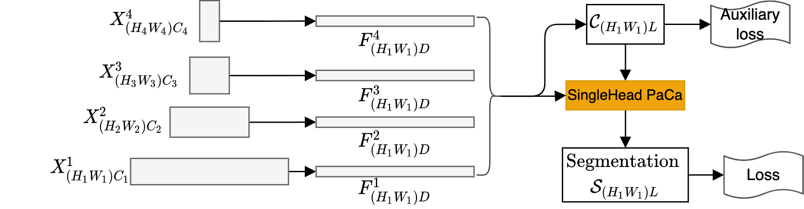

## PaCa-ViT (CVPR'23) <br> <sub>Official PyTorch Implementation</sub>

This repo contains the PyTorch version of model definitions (*Tiny, Small, Base*), training code and pre-trained weights for ImageNet-1k classification, MS-COCO object detection and instance segmentation, and MIT-ADE20k image semantic segmenation for our PaCa-ViT paper. It is refactored using [PyTorch 2.0](https://pytorch.org/blog/pytorch-2.0-release/) and the latest [timm](https://github.com/huggingface/pytorch-image-models), [mmdetection 3.x](https://github.com/open-mmlab/mmdetection/tree/v3.0.0) and [mmsegmentation 1.x](https://github.com/open-mmlab/mmsegmentation/tree/v1.0.0). The trained checkpoints are converted accordingly. We thank the teams of those open-sourced packages.  

> [**PaCa-ViT: Learning Patch-to-Cluster Attention in Vision Transformers**](https://arxiv.org/abs/2203.11987)<br>
> Ryan Grainger, Thomas Paniagua, Xi Song, Naresh Cuntoor, Mun Wai Lee and Tianfu Wu\
> <br>NC State University, BlueHalo, X. Song is an independent researcher.<br>

Vision Transformers (ViTs) are built on the assumption of treating image patches as ``visual tokens" and learn patch-to-patch attention. The patch embedding based tokenizer has a semantic gap with respect to its counterpart, the textual tokenizer. The patch-to-patch attention suffers from the quadratic complexity issue, and also makes it non-trivial to explain learned ViTs. To address these issues in ViT, this paper proposes to learn **Patch-to-Cluster attention (PaCa)** in ViTs. 

<p align="center">

</p>

Queries in our PaCa-ViT starts with patches, while keys and values are directly based on clustering (with a predefined small number of clusters). The clusters are learned end-to-end, leading to better tokenizers and inducing joint clustering-for-attention and attention-for-clustering for better and interpretable models. The quadratic complexity is relaxed to linear complexity. The proposed PaCa module is used in designing efficient and interpretable ViT backbones and semantic segmentation head networks. 

<p align="center">

</p>

We study four aspects of the PaCa module: 

> **Where to compute the cluster assignments?** Consider the stage-wise pyramidical architecture of assembling ViT blocks, a stage consists of a number of blocks. We test two settings: *block-wise* by computing the cluster assignment for each block, or *stage-wise* by computing it only in the first block in a stage and then sharing it with the remaining blocks. Both give comparable performance. The latter is more efficient when the model becomes deeper. 

> **How to compute the cluster assignment?** We also test two settings: using 2D convolution or Multi-Layer Perceptron (MLP) based implementation. Both have similar performance. The latter is more generic and sheds light on exploiting PaCa for more general *Token-to-Cluster attention (ToCa)* in a domain agnostic way. 

<p align="center">

</p>

> **How to leverage an external clustering teacher?** We investigate a method of exploiting a lightweight convolution neural network  in learning the cluster assignments that are shared by all blocks in a stage. It gives some interesting observations, and potentially pave a way for distilling large foundation models. 

<p align="center">

</p>

> **What if the number of clusters is known?** We further extend the PaCa module in designing an effective head sub-network for dense prediction tasks such as image semantic segmentation where the number of clusters $M$ is available based on the ground-truth number of classes and the learned cluster assignment $\mathcal{C}_{N, M}$ has direct supervision. The PaCa segmentation head significantly improves the performance with reduced model complexity. 

<p align="center">

</p>

## Results and Trained Models
> *(please refer to the paper for details of the settings)*

- [] To leverage the efficient implementation of multi-head self-attention via the [xformers](https://github.com/facebookresearch/xformers) package, the `head dimensions` should be divisible by $32$, for which we can [change the number of heads](./models/paca_vit.py#L860) in the current archtectural settings accordingly. We have observed significantly faster training in our on-going experiments. 
- [] We did not test the simpler linear projection based clustering module (i.e., [Linear+Softmax](./models/paca_vit.py#L128)) in our paper (in addition the convolution-based and mlp-based clustering modules), which we have preliminarily  observed is also effective using the blockwise clustering setting.

### **ImageNet-1K (224x224) trained weights**
| name | acc@1 | #params | FLOPs | model |
|:---:|:---:|:---:| :---:|:---:|
| PaCa-Tiny (conv) |  80.9 | 12.2M  | 3.2G | [model](https://github.com/iVMCL/PaCaViT/releases/download/pacavit/IMNET_224_pacavit_tiny_p2cconv_100_0.pth) |
| PaCa-Small (conv) |  83.08 | 22.0M  | 5.5G | [model](https://github.com/iVMCL/PaCaViT/releases/download/pacavit/IMNET_224_pacavit_small_p2cconv_100_0.pth) |
| PaCa-Small (mlp) |  83.13 | 22.6M  | 5.9G | [model](https://github.com/iVMCL/PaCaViT/releases/download/pacavit/IMNET_224_pacavit_small_p2cmlp_100_0.pth) |
| PaCa-Small (teacher) |  83.17 | 21.1M  | 5.4G | [model](https://github.com/iVMCL/PaCaViT/releases/download/pacavit/IMNET_224_pacavit_convmixer_small_100.pth) |
| PaCa-Base (conv)|  83.96 | 46.9M  | 9.5G | [model](https://github.com/iVMCL/PaCaViT/releases/download/pacavit/IMNET_224_pacavit_base_p2cconv_100_0.pth) |
| PaCa-Base (teacher)|  84.22 | 46.7M  | 9.7G | [model](https://github.com/iVMCL/PaCaViT/releases/download/pacavit/IMNET_224_pacavit_convmixer_base_100.pth) |

We conduct some ablation studies on the number of clusters using the `PaCa-Small` architecture and `convolution-based` implementation of clustering. 
| where | #Clusters, $M$ | acc@1 | #params | FLOPs | model |
|:---:|:---:|:---:|:---:| :---:|:---:|
|  stage-wise | [2,2,2,0] |  82.28 | 22.0M  | 4.7G | [model](https://github.com/iVMCL/PaCaViT/releases/download/pacavit/IMNET_224_pacavit_small_p2cconv_2_0.pth) |
| stage-wise | [49,49,49,0] |  82.95 | 22.0M  | 5.0G | [model](https://github.com/iVMCL/PaCaViT/releases/download/pacavit/IMNET_224_pacavit_small_p2cconv_49_0.pth) |
| stage-wise | [49,64,81,100] |  82.98 | 22.2M  | 5.3G | [model](https://github.com/iVMCL/PaCaViT/releases/download/pacavit/IMNET_224_pacavit_small_p2cconv_49_100.pth) |
| stage-wise | [100,81,64,49] |  82.87 | 22.2M  | 5.3G | [model](https://github.com/iVMCL/PaCaViT/releases/download/pacavit/IMNET_224_pacavit_small_p2cconv_100_49.pth) |
| stage-wise | [100,100,100,100] |  83.05 | 22.3M  | 5.6G | [model](https://github.com/iVMCL/PaCaViT/releases/download/pacavit/IMNET_224_pacavit_small_p2cconv_100_49.pth) |
| block-wise | [100,100,100,100] |  82.93 | 24.1M  | 6.1G | [model](https://github.com/iVMCL/PaCaViT/releases/download/pacavit/IMNET_224_pacavit_small_p2cconv_100_blockwise.pth) |

### **MS-COCO trained Mask R-CNN weights** 
| name | #params | FLOPs | $AP^b$ | $AP_{50}^b$ | $AP_{75}^b$ | $AP^m$ | $AP_{50}^m$ | $AP_{75}^m$  | model |
|:---:|:---:|:---:| :---:|:---:|:---:|:---:|:---:|:---:|:---:|
| PaCa-Tiny (conv) | 32.0 | 252 | 43.3 | 66.0 | 47.5 | 39.6 | 62.9 | 42.4| [model](https://github.com/iVMCL/PaCaViT/releases/download/pacavit/mask_rcnn_pacavit_tiny_p2cconv_100_0_mstrain_480_800_1x_coco.pth)|
| PaCa-Small (conv) | 41.8 | 296 | 46.4 | 68.7 | 50.9 | 41.8 | 65.5 | 45.0| [model](https://github.com/iVMCL/PaCaViT/releases/download/pacavit/mask_rcnn_pacavit_small_p2cconv_100_0_mstrain_480_800_1x_coco.pth)|
| PaCa-Small (mlp) | 42.4 | 303 |  46.6  | 69.0 | 51.3 | 41.9 | 65.7 | 45.0| [model](https://github.com/iVMCL/PaCaViT/releases/download/pacavit/mask_rcnn_pacavit_small_p2cmlp_100_0_mstrain_480_800_1x_coco.pth)|
| PaCa-Small (teacher) | 40.9 | 292 | 45.8 | 68.0 | 50.3 | 41.4 | 64.9 | 44.5| [model](https://github.com/iVMCL/PaCaViT/releases/download/pacavit/mask_rcnn_pacavit_convmixer_tiny_100_0_mstrain_480_800_1x_coco.pth)|
| PaCa-Base (conv) | 66.6 | 373 | 48.0 | 69.7 | 52.1 | 42.9 | 66.6 | 45.6 | [model](https://github.com/iVMCL/PaCaViT/releases/download/pacavit/mask_rcnn_pacavit_base_p2cconv_100_0_mstrain_480_800_1x_coco.pth)|
| PaCa-Base (teacher) | 61.4 | 372 | 48.3 | 70.5 | 52.6 | 43.3 | 67.2 | 46.6| [model](https://github.com/iVMCL/PaCaViT/releases/download/pacavit/mask_rcnn_pacavit_convmixer_base_100_0_mstrain_480_800_1x_coco.pth)|

For the models in the ablation studies, 
| where | #Clusters, $M$ | #params | FLOPs | $AP^b$ | $AP_{50}^b$ | $AP_{75}^b$ | $AP^m$ | $AP_{50}^m$ | $AP_{75}^m$ | model |
|:---:|:---:|:---:|:---:| :---:|:---:|:---:|:---:|:---:|:---:|:---:|
| stage-wise | [2,2,2,0] | 41.6 | 283 | 45.5 | 68.4 | 49.9 | 41.1 | 64.9 | 43.9 | [model](https://github.com/iVMCL/PaCaViT/releases/download/pacavit/mask_rcnn_pacavit_small_p2cconv_2_0_mstrain_480_800_1x_coco.pth) |
| stage-wise | [49,49,49,0] | 41.8 | 289 | 46.2 | 68.6 | 50.6 | 41.6 | 65.4 | 44.3 | [model](https://github.com/iVMCL/PaCaViT/releases/download/pacavit/mask_rcnn_pacavit_small_p2cconv_49_0_mstrain_480_800_1x_coco.pth) |
| stage-wise | [49,64,81,100] |  42.0 | 289 |46.1 |68.7|50.4 |41.5|65.3| 44.3 | [model](https://github.com/iVMCL/PaCaViT/releases/download/pacavit/mask_rcnn_pacavit_small_p2cconv_49_100_mstrain_480_800_1x_coco.pth) |
| stage-wise | [100,81,64,49] |  42.0 | 291 |46.1 |68.4 |50.3 |41.7 |65.4 |44.7 | [model](https://github.com/iVMCL/PaCaViT/releases/download/pacavit/mask_rcnn_pacavit_small_p2cconv_100_49_mstrain_480_800_1x_coco.pth) |
| stage-wise | [100,100,100,100] |  42.0 | 294 |46.4 |68.8 |51.0|41.8| 65.6| 44.6  | [model](https://github.com/iVMCL/PaCaViT/releases/download/pacavit/mask_rcnn_pacavit_small_p2cconv_100_mstrain_480_800_1x_coco.pth) |
| block-wise | [100,100,100,100] |  44.0 | 304| 46.5 |68.7 |51.0| 41.8| 65.6 |45.0 | [model](https://github.com/iVMCL/PaCaViT/releases/download/pacavit/mask_rcnn_pacavit_small_p2cconv_100_blockwise_mstrain_480_800_1x_coco.pth) |

### **MIT-ADE2Ok trained weights** 
| name | head | #params | FLOPs | mIOU (single) | model | 
|:---:|:---:|:---:| :---:|:---:|:---:|
|PaCa-Tiny (conv) | UperNet | 41.6 | 229.9 | 44.49 | [model](https://github.com/iVMCL/PaCaViT/releases/download/pacavit/upernet_pacavit_tiny_p2cconv_100_0_512x512_160k_ade20k.pth) |
|PaCa-Small (conv) | UperNet | 51.4 | 242.7 | 47.6 | [model](https://github.com/iVMCL/PaCaViT/releases/download/pacavit/upernet_pacavit_small_p2cconv_100_0_512x512_160k_ade20k.pth) |
|PaCa-Base (conv) | UperNet | 77.2  | 264.1 | 49.67 | [model](https://github.com/iVMCL/PaCaViT/releases/download/pacavit/upernet_pacavit_base_p2cconv_100_0_512x512_160k_ade20k.pth) |
|PaCa-Tiny (conv) | PaCa | 13.3 | 34.4 | 45.65 | [model](https://github.com/iVMCL/PaCaViT/releases/download/pacavit/pacahead_pacavit_tiny_p2cconv_100_0_512x512_160k_ade20k.pth) |
|PaCa-Small (conv) | PaCa | 23.2 | 47.2 | 48.3 | [model](https://github.com/iVMCL/PaCaViT/releases/download/pacavit/pacahead_pacavit_small_p2cconv_100_0_512x512_160k_ade20k.pth) |
|PaCa-Small (mlp) | PaCa | 24.0 | 50.0 | 48.2 | [model](https://github.com/iVMCL/PaCaViT/releases/download/pacavit/pacahead_pacavit_small_p2cmlp_100_0_512x512_160k_ade20k.pth) |
|PaCa-Small (teacher) | PaCa | 22.2 | 46.4 | 46.2 | [model](https://github.com/iVMCL/PaCaViT/releases/download/pacavit/pacahead_pacavit_convmixer_small_100_0_512x512_160k_ade20k.pth) |
|PaCa-Base (conv) | PaCa | 48.0 | 68.5 | 50.39 | [model](https://github.com/iVMCL/PaCaViT/releases/download/pacavit/pacahead_pacavit_base_p2cconv_100_0_512x512_160k_ade20k.pth) |
|PaCa-Base (teacher) | PaCa | 48.8 | 68.7 | 48.4 | [model](https://github.com/iVMCL/PaCaViT/releases/download/pacavit/pacahead_pacavit_convmixer_base_100_0_512x512_160k_ade20k.pth) |

For the models in the ablation studies, 
| where | #Clusters, $M$ | head|  #params | FLOPs | mIOU (single) | model |
|:---:|:---:|:---:|:---:| :---:|:---:|:---:|
| stage-wise | [2,2,2,0] | PaCa | 23.2 | 47.2 | 47.7 | [model](https://github.com/iVMCL/PaCaViT/releases/download/pacavit/upernet_pacavit_small_p2cconv_2_0_512x512_160k_ade20k.pth) |
| stage-wise | [49,49,49,0] | PaCa |23.4 | 47.3 | 47.8  | [model](https://github.com/iVMCL/PaCaViT/releases/download/pacavit/upernet_pacavit_small_p2cconv_49_0_512x512_160k_ade20k.pth) |
| stage-wise | [49,64,81,100] |  PaCa |23.2 | 47.2 | 48.1 | [model](https://github.com/iVMCL/PaCaViT/releases/download/pacavit/upernet_pacavit_small_p2cconv_49_100_512x512_160k_ade20k.pth) |
| stage-wise | [100,81,64,49] |  PaCa |23.7 | 47.3 | 47.6 | [model](https://github.com/iVMCL/PaCaViT/releases/download/pacavit/upernet_pacavit_small_p2cconv_100_49_512x512_160k_ade20k.pth) |
| stage-wise | [100,100,100,100] |  PaCa |23.4 | 47.3 | 48.3  | [model](https://github.com/iVMCL/PaCaViT/releases/download/pacavit/upernet_pacavit_small_p2cconv_100_512x512_160k_ade20k.pth) |
| block-wise | [100,100,100,100] |  PaCa |25.8 | 50.9 | 48.0 | [model](https://github.com/iVMCL/PaCaViT/releases/download/pacavit/upernet_pacavit_small_p2cconv_100_blockwise_512x512_160k_ade20k.pth) |

## Installation
We provide self-contained [installation scripts](install.sh) and [environment configurations](environment.yaml). 

```shell
git clone https://github.com/iVMCL/PaCaViT.git 
cd PaCaViT 
ln -s ./models ./classification/
ln -s ./models ./detection/
ln -s ./models ./segmentation/
chmod +x ./*.sh
./install.sh pacavit 
```

## Training
We provide scripts for training models using a single-node GPU server (e.g., 8 NVIDIA GPUs).
### **ImageNet-1k Classification**
We borrow from the [timm](https://github.com/huggingface/pytorch-image-models) package. 

> *Data preparation.* Download the [ImageNet dataset](http://image-net.org/download) to `YOUR_IMNET_PATH` and unzip it. Move validation images to labeled subfolders using this [script](https://raw.githubusercontent.com/soumith/imagenetloader.torch/master/valprep.sh). 
```shell
cd $YOUR_IMNET_PATH/Data/CLS-LOC/val
chmod +x ./valprep.sh
./valprep.sh
```
> Add the symbolic link to the ImageNet dataset, 
```shell
cd PaCaViT
mkdir datasets
ln -s $YOUR_IMNET_PATH/Data/CLS-LOC ./datasets/IMNET
```
> Use the provided self-contained [training script](./classification/train_timm.sh) and [model configurations](./classification/configs/imagenet_vit_adamw.yml) to train a model, 
```
train_timm.sh \
Config_file \
Model_name \
Dataset_name \
Img_size \
Remove_old_if_exist_0_or_1 \
Resume_or_not_if_exist \
Exp_name \
Tag \
Gpus \
Nb_gpus \
Workers \
Port \
[others]
```    
e.g., train a PaCa-Tiny model [pacavit_tiny_p2cconv_100_0](./models/paca_vit.py#L935), 
```shell 
cd PaCaViT/classification 
./train_timm.sh configs/imagenet_vit_adamw.yml pacavit_tiny_p2cconv_100_0 IMNET 224 1 1 cvpr23 try1 0,1,2,3,4,5,6,7 8 8 23900
```
The training results will be saved in `PaCaViT/work_dirs/classification/cvpr23/pacavit_tiny_p2cconv_100_0_try1/` before the training is completed. After completed, they will be auto-moved to 
`PaCaViT/work_dirs/classification/cvpr23/TrainingFinished/pacavit_tiny_p2cconv_100_0_try1/`

### **MS-COCO Object Detection and Instance Segmentation**
We borrow from the [mmdetection 3.x](https://github.com/open-mmlab/mmdetection/tree/v3.0.0) package. 

> *Data preparation*: Download [COCO 2017 datasets](https://cocodataset.org/#download) to `YOUR_COCO_PATH`. 

> Add the symbolic link to the MS-COCO dataset, 
```shell
cd PaCaViT
ln -s $YOUR_COCO_PATH ./datasets/coco
```

> Use the provided [training script](./detection/train_mmdet.sh) and select one of [the configuration files](./detection/configs/paca_vit/mask_rcnn_1x/). 
```shell
cd PaCaViT/detection
chmod +x ./*.sh
```

```
train_mmdet.sh \
Relative_config_filename \
Remove_old_if_exist_0_or_1 \
Exp_name \
Tag \
gpus \
nb_gpus \
port \
[others]
```
e.g., train a Mask R-CNN with the PaCa-Tiny backbone [pacavit_tiny_p2cconv_100_0_downstream](./models/paca_vit.py#L1477), 
```shell 
cd PaCaViT/detection 
./train_mmdet.sh configs/paca_vit/mask_rcnn_1x/mask_rcnn_pacavit_tiny_p2cconv_100_0_mstrain_480_800_1x_coco.py 1 cvpr23 try1 0,1,2,3,4,5,6,7 8 23900
```
The training results will be saved in `PaCaViT/work_dirs/detection/cvpr23/mask_rcnn_pacavit_tiny_p2cconv_100_0_mstrain_480_800_1x_coco_try1/`

### **MIT-ADE20k Image Semantic Segmentation**
We borrow from the [mmsegmentation 1.x](https://github.com/open-mmlab/mmsegmentation/tree/v1.0.0) package. 

> *Data preparation*: Download [MIT ADE2Ok 2016 dataset](https://groups.csail.mit.edu/vision/datasets/ADE20K/) to `YOUR_ADE_PATH`. 

> Add the symbolic link to the MIT-ADE dataset, 
```shell
cd PaCaViT
ln -s $YOUR_ADE_PATH ./datasets/ADEChallengeData2016
```

> Use the provided [training script](./segmentation/train_mmseg.sh) and select one of [the configuration files](./segmentation/configs/paca_vit/). 
```shell
cd PaCaViT/segmentation
chmod +x ./*.sh
```

```
train_mmseg.sh \
Relative_config_filename \
Remove_old_if_exist_0_or_1 \
Exp_name \
Tag \
gpus \
nb_gpus \
port \
[others]
```
e.g., train the segmentor with the [PaCa segmentation head](./segmentation/mmseg_custom/models/decode_heads/paca_head.py) and the PaCa-Tiny backbone [pacavit_tiny_p2cconv_100_0_downstream](./models/paca_vit.py#L1477), 
```shell 
cd PaCaViT/segmentation 
./train_mmseg.sh configs/paca_vit/paca_head/pacahead_pacavit_tiny_p2cconv_100_0_512x512_160k_ade20k.py 1 cvpr23 try1 0,1,2,3,4,5,6,7 8 23900
```
The training results will be saved in `PaCaViT/work_dirs/segmentation/cvpr23/pacahead_pacavit_tiny_p2cconv_100_0_512x512_160k_ade20k_try1/`

## Evaluation
### Accuracy 
Please refer to the provided self-contained evaluation scripts for [ImageNet-1k evaluation](./classification/validate.sh), [MS-COCO evaluation](./detection/test_mmdet.sh) and [MIT-ADE20k evaluation](./segmentation/test_mmseg.sh). 

### Model Parameters and FLOPs
Please refer to the provided scripts for [benchmarking a feature backbone](./classification/benchmark.sh), [benchmarking a detector](./detection/get_flops.py) and [benchmarking a segmentator](./segmentation/get_flops.py). 


## License
This project is released under the MIT license. Please see the [LICENSE](LICENSE) file for more information.

## Citation
If you find this repository helpful, please consider citing:
```bibtex
@inproceedings{Grainger2023PaCaViT,
  title={PaCa-ViT: Learning Patch-to-Cluster Attention in Vision Transformers},
  author={Ryan Grainger and Thomas Paniagua and Xi Song and Naresh Cuntoor and Mun Wai Lee and Tianfu Wu},
  booktitle={Proceedings of the IEEE/CVF Conference on Computer Vision and Pattern Recognition},
  year={2023}
}
```
